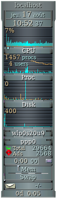
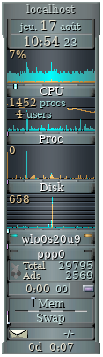

# gkrellm-pihole
gkrellm plugin for pihole monitoring

This gkrellm plugin sits under your network chart and monitors you Pihole:
total number of DNS queries and numbers of blocked queries in the last 24 hours.

*To compile*:
./build

*To use*:
copy gkrellm-pihole.so to your plusing directory (usually ~/.gkrellm2/plugins) and activate from the configuration.

Then you have to configure the Pihole hostname or IP, and the API key, in the plugin configuration tab.
You can check stdout for messages if the plugin cannot contact the Pihole.

When the Pihole is online and the plugin properly configured, the Pihole icon show in colours:

If gkrellm is not properly configured, or the Pihole is offline, the icon shows in black and white:

